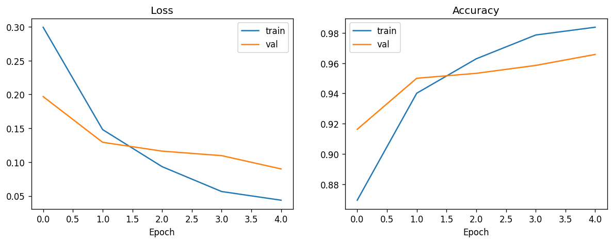
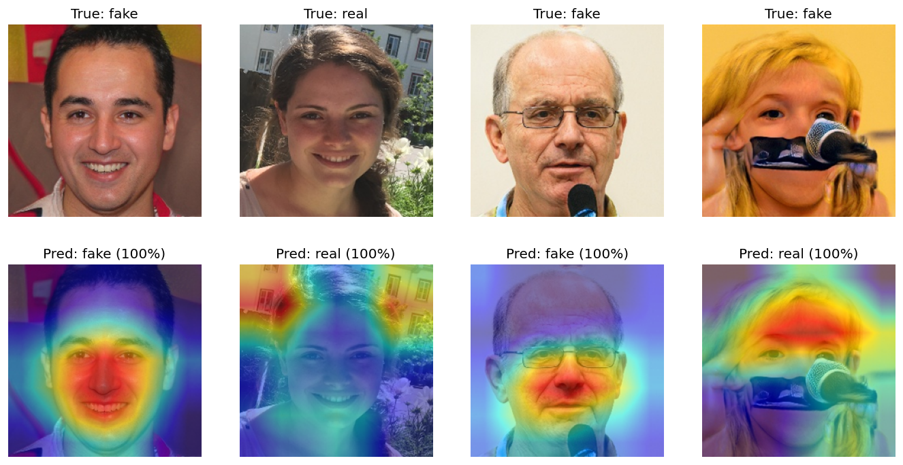

# DeepFake Face Detector

A local web app that classifies a face photo as **real** or **AI-generated (fake)**,
built around a ResNet18 classifier trained in Google Colab. Upload an image and get
back a prediction, a confidence score, and a **Grad-CAM heatmap** showing which
pixels the model actually looked at.


<!-- Replace docs/demo.gif with a screen recording of the app in use. -->

FastAPI backend + a single-file HTML/JS frontend, no build step, one command to run.

---

## Results

Evaluated on a 4,000-image held-out test set (StyleGAN-generated fakes vs. real
photos, 50/50 split), after fine-tuning for 5 epochs on a 20,000-image subsample.

| Metric | Score |
|---|---|
| Accuracy | 96.6% |
| Macro F1 | 0.966 |

**Confusion matrix**

|  | Predicted: Fake | Predicted: Real |
|---|---|---|
| **Actual: Fake** (2000) | 1929 (correct) | 71 (missed) |
| **Actual: Real** (2000) | 65 (false alarm) | 1935 (correct) |

| Class | Precision | Recall | F1 |
|---|---|---|---|
| Fake | 0.967 | 0.965 | 0.966 |
| Real | 0.965 | 0.968 | 0.966 |

**Training curves**



**Grad-CAM examples**



---

## Findings

Grad-CAM visualization on the trained model surfaced two problems that raw accuracy
alone hides:

- **Shortcut learning.** On some correctly classified images, the heatmap lights up
  background regions (hair edges, image borders, compression artifacts) rather than
  facial features. This suggests the model partly learned dataset-specific artifacts
  of the StyleGAN generation/compression pipeline rather than "what a fake face looks
  like" in a way that would generalize.
- **Overconfidence on errors.** On misclassified examples, the model was frequently
  ~100% confident in the wrong answer, rather than uncertain. A model that fails
  loudly (95%+ confidence) is more dangerous in practice than one that fails quietly,
  because there's no confidence signal to catch the mistake downstream.

## Limitations

- **Single-generator training data.** The model was trained only on StyleGAN faces
  from the Kaggle "140k Real and Fake Faces" dataset. It has not been evaluated
  against other generators (diffusion models, other GAN architectures, face-swap
  tools) and likely generalizes poorly to them.
- **Detection tool, not a generator.** This project classifies images; it does not
  create or modify them.
- **Not a forensic/legal tool.** A 96.6% test accuracy still means roughly 1 in 30
  images is misclassified, and real-world images (different lighting, compression,
  camera sources) will differ from this curated dataset. Don't treat a single
  prediction as ground truth.

**Next steps:** crop to the face before training (remove background shortcut
signal), add confidence calibration (e.g. temperature scaling) so confidence
reflects actual reliability, and test against other deepfake generators to measure
generalization.

---

## How it works (plain language)

**Transfer learning.** Instead of training a neural network from scratch (which
needs millions of images), this model starts from a ResNet18 that was already
pretrained on ImageNet — 1.2M photos across 1,000 everyday object categories. That
pretraining already taught the network general-purpose visual features: edges,
textures, shapes, color gradients. Training then only had to *adapt* those features
to the new, much narrower task (real vs. fake face), which needs far less data and
compute. Here, the early layers were frozen (kept as-is) and only the last
convolutional block (`layer4`) plus a new final classification layer were
fine-tuned on the face dataset.

**Why ResNet18.** ResNet ("Residual Network") solved a real problem in deep CNNs:
past a certain depth, adding more layers made accuracy *worse*, not better, because
gradients had trouble flowing back through so many stacked layers during training.
ResNet's fix is the "residual connection" — each block learns a small adjustment
*added* to its input, rather than a full transformation, which keeps gradients
flowing cleanly through very deep networks. ResNet18 (18 layers) is the smallest,
fastest member of that family — a good fit here because the dataset is modest
(20k images) and the task (binary classification) doesn't need the capacity of a
deeper variant like ResNet50.

**Grad-CAM.** Gradient-weighted Class Activation Mapping answers "which pixels
mattered for this prediction?" It looks at the gradients flowing back into the last
convolutional layer (`layer4`) for the predicted class, uses them to weight that
layer's feature maps, and overlays the result as a heatmap. Warm colors mean "this
region pushed the model toward its prediction." It's a diagnostic tool, not part of
the classifier itself — it's what surfaced the shortcut-learning and overconfidence
issues above.

---

## Project structure

```
backend/
  main.py       FastAPI app: /health, /predict, serves the frontend
  model.py      Checkpoint loading, preprocessing, Grad-CAM inference
frontend/
  index.html    Single-file UI (drag/drop upload, results, heatmap)
tests/
  conftest.py   Fixtures (fake checkpoint, test client, sample image)
  test_api.py   API tests
models/
  best_model.pth  Trained weights (not committed — see .gitignore)
docs/
  training_curves.png
  gradcam_examples.png
notebooks/
  AiFake.ipynb  Colab training notebook
```

## API

**`GET /health`**
```json
{"status": "ok", "model_loaded": true}
```

**`POST /predict`** — multipart form upload, field name `file`, image only, max 10 MB.
```json
{
  "label": "fake",
  "confidence": 0.98,
  "probabilities": {"fake": 0.98, "real": 0.02},
  "heatmap_base64": "iVBORw0KG...",
  "latency_ms": 42.1
}
```
Returns `400` for non-image or oversized uploads, `503` if the model weights
aren't loaded.

---

## Setup (Windows PowerShell)

```powershell
# 1. Create and activate a virtual environment
python -m venv .venv
.\.venv\Scripts\Activate.ps1

# 2. Install dependencies (CPU-only PyTorch)
pip install -r requirements.txt

# 3. Make sure the trained weights are in place
#    models\best_model.pth  (already included in this folder)

# 4. Run the app (backend + frontend on one server)
uvicorn backend.main:app --reload

# 5. Open the app
#    http://127.0.0.1:8000

# Run the test suite
pytest
```

## Dataset & training

Trained in Google Colab (see `notebooks/AiFake.ipynb`) on the
[140k Real and Fake Faces](https://www.kaggle.com/datasets/xhlulu/140k-real-and-fake-faces)
dataset (real photos vs. StyleGAN-generated faces), using a 20,000-image
subsample, 5 epochs, mixed precision, on a T4 GPU. This repo only contains the
inference app built around the exported checkpoint — no training code here.
